# Cadence

  

Cadence is a modern, local-first Android training journal for logging strength and conditioning workouts, with a Wear OS companion app for recording sets without reaching for your phone. It takes its starting premise — a fast, unopinionated training notebook rather than a prescriptive fitness platform — from [FitNotes](https://www.fitnotesapp.com/), and updates the experience for current Android and Wear OS.

## Status

This repository is currently **specification-only**: there is no application code yet. [`SPEC.md`](SPEC.md) and [`SCREENS.md`](SCREENS.md) are the current source of truth, and the next step is a full visual design pass covering the whole screen inventory as one cohesive system, handed to Claude Design.

## Documentation

- [`SPEC.md`](SPEC.md) — product, UX, data model, and platform specification
- [`SCREENS.md`](SCREENS.md) — the companion screen-and-state inventory for UI design
- [`AGENTS.md`](AGENTS.md) — contributor conventions (spelling, commits, PRs, licensing, planned repository layout)
- [`CLAUDE.md`](CLAUDE.md) — project guidance for Claude Code

## Planned architecture

Cadence is designed to follow [Threshold](https://github.com/liminal-hq/threshold)'s engineering patterns — a Tauri v2 app with a React/TypeScript frontend, Rust-owned domain logic and SQLite, and a native Kotlin/Compose Wear OS companion — while using an entirely new, purpose-built UI. See [`AGENTS.md`](AGENTS.md#repository-layout) for the planned repository layout; none of it exists yet, and it will be created once implementation begins.

## Contributing

See [`AGENTS.md`](AGENTS.md) for the full conventions. In short: Canadian English spelling everywhere, Conventional Commits with human-readable, prefix-free PR titles, and no pushes to shared branches unless explicitly requested.

## Licence

Dual-licensed under [Apache-2.0](LICENSE-APACHE) or [MIT](LICENSE-MIT), at your option.

Copyright 2026 Liminal HQ, Scott Morris.
