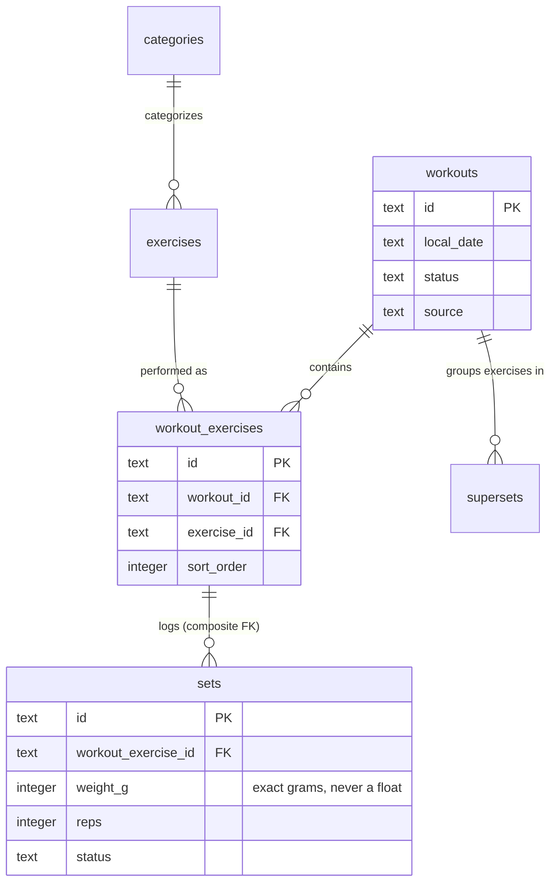
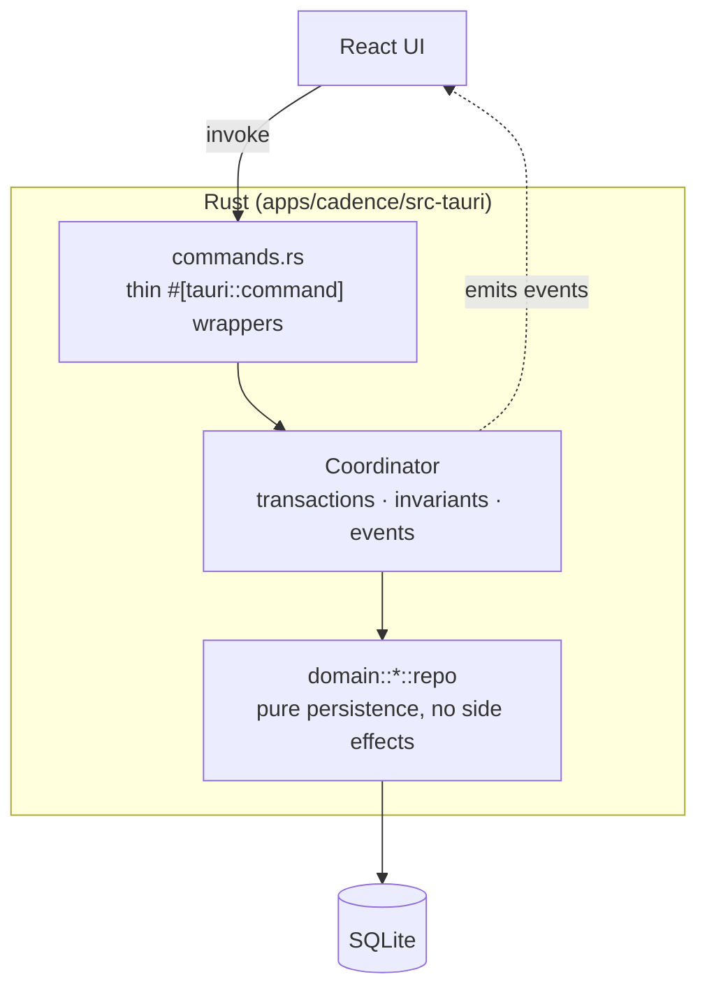
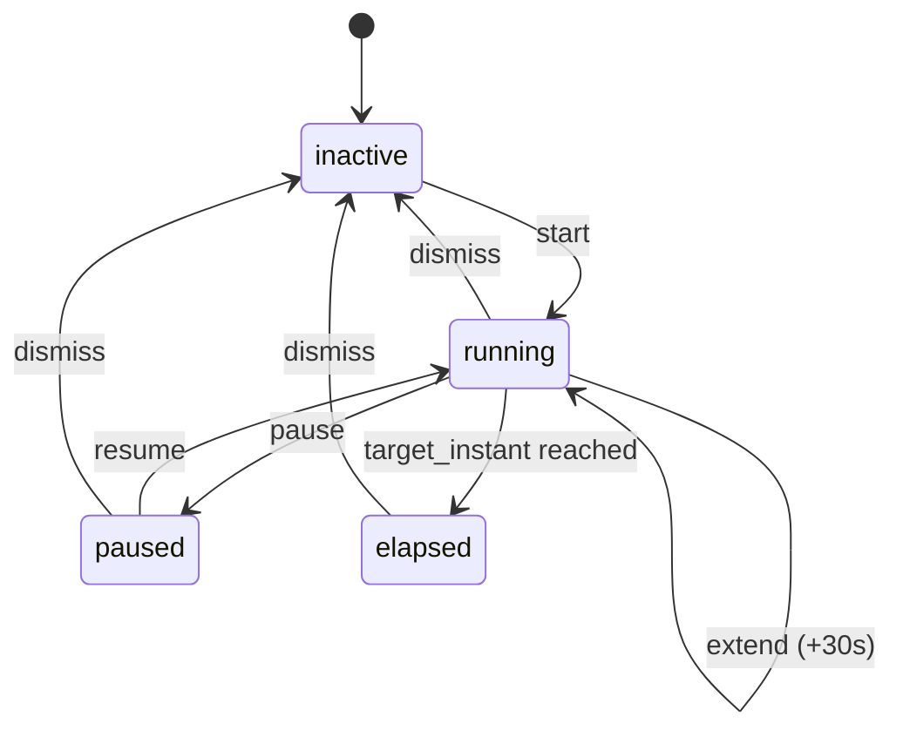
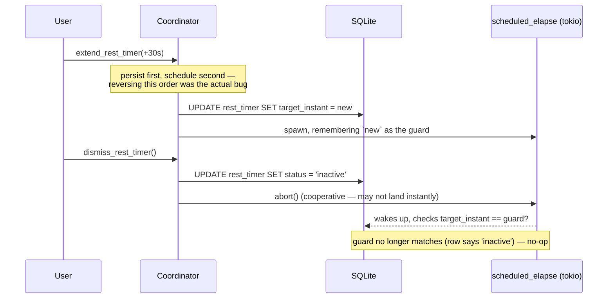

# The Backend: SQLite, Migrations, and the Coordinator Pattern

_Companion reading for PRs [#8](https://github.com/liminal-hq/cadence/pull/8) and [#9](https://github.com/liminal-hq/cadence/pull/9). Want the animated walkthrough instead? → **[Open the interactive version](https://claude.ai/code/artifact/19a5c3dd-c2a6-4100-8e3a-b0f9399ad2ac)**._

---

Six weeks ago, Cadence's entire backend was a JavaScript object living in a browser tab. Every workout, every set, every rest timer — gone the instant you hit refresh. That's a completely reasonable way to build a UI: you get to iterate on screens without a database schema fighting you. But it's not an app.

This document is about what replaced it: a real Rust domain layer sitting on top of an embedded SQLite database, reachable from React through Tauri's command bridge. It's a small case study in a few ideas that show up in a lot of well-built local-first software — versioned migrations that actually run, a persistence layer that stays honest about what it doesn't know, and a state machine that has to survive the process restarting out from under it.

## The shape of the problem

A training journal's data model looks deceptively simple — a workout has exercises, exercises have sets — until you write down everything it actually has to be true at once:

- **Weight values must never drift.** `82.5kg` typed in a thousand times has to come back as exactly `82.5kg`, not `82.49999999999997kg`. Floats are wrong for this.
- **A set's exercise must always match its workout-exercise's exercise.** This sounds obvious until you realize nothing forces it to be true — it's an invariant someone has to actively defend, forever, in every code path that touches a set.
- **The schema has to support features that don't exist yet.** Routines, goals, body measurements, a Wear OS watch syncing in the background — none of these are built, but the _shape_ of where they'll live needs to exist now, or every future feature becomes a migration that touches production data.
- **Nothing may silently fail to run.** A schema change that only _some_ installs picked up is the kind of bug that surfaces three months later as "why does my friend's app have a column mine doesn't."

Every decision below is really just an answer to one of these four problems.

## Storage: integers all the way down

Cadence never stores a weight as a float. `82.5kg` is stored as `82500` — grams, as a 64-bit integer. Distances are metres. Barbell plate weights are "milli-units of whatever unit the barbell itself uses" (a kg barbell's plates are stored in milli-kg; a lb barbell's plates are stored in milli-lb), because the plate calculator's arithmetic has to be _exact_, and exact arithmetic on floats is a contradiction in terms.

The conversion between "what's stored" and "what the UI shows" happens at exactly one boundary — the row-to-DTO mapping in each domain module — so nothing upstream of that boundary ever has to think about it again.



That third relationship — `workout_exercises` to `sets` — is doing more work than the diagram lets on. It isn't a normal single-column foreign key. It's a **composite** one: `sets(workout_exercise_id, workout_id, exercise_id)` references `workout_exercises(id, workout_id, exercise_id)` as a matched triple. The database itself now refuses to let a set claim an exercise that doesn't match its own workout-exercise's exercise. That's an invariant that used to live only in the mock's JavaScript logic — trusted, but not _enforced_. It's now a property of the storage engine. Nobody can accidentally violate it, including future-us.

## Migrations that actually run

Here's a real anti-pattern, seen in production more than once: a codebase has a `migrations/` folder full of `.sql` files that describe the schema history, _and_ a separate `ensure_schema()` function that imperatively checks "does this column exist? if not, add it" every time the app starts. The two drift. The migrations describe a schema nobody's database actually has, because the `ensure_schema` checker quietly patched around whatever was missing. Nobody notices until someone tries to run the migrations fresh and it breaks in a new, unfamiliar way.

Cadence has exactly one schema-construction path:

```rust
pub static MIGRATOR: sqlx::migrate::Migrator = sqlx::migrate!("./migrations");
```

That's it. Every real install runs it, unconditionally, on every launch. Every test — all 113 of them — builds its database by running the exact same migrator against a fresh in-memory SQLite file. There is no second mechanism, which means there's no _drift_ between "what tests run against" and "what a real user's laptop has." If the migrations are broken, the very first test run tells you, not a bug report three months from now.

The corollary: migrations are **additive only**. Once `0002_seed_defaults.sql` shipped, it was never edited again — not even to fix a typo. Need to change something a migration already did? Write a new migration that does the fixing. `0004_retire_demo_history.sql` is a good example: rather than reach back and edit the seed migration that inserted three years of a demo user's fake workouts, a fourth migration simply deletes them by id. The history is honest: here's what we shipped, and here's what we later decided to undo, in the order we decided it.

## Three layers, one direction of dependency

The Rust side is organized as three layers, and the discipline is that **each layer only knows about the one below it**:



**`repo.rs` functions are boring on purpose.** `sets::repo::add()` inserts a row and returns it. It doesn't know about revision counters, doesn't emit events, doesn't enforce cross-table rules. Give it a connection and some values; it does exactly the SQL implied by its name and nothing else. That's what makes it trivially testable — every repo function has a handful of unit tests that spin up a real (in-memory) SQLite database and check the SQL actually does what it claims.

**The `Coordinator` is where the interesting decisions live.** It owns transaction boundaries, so an operation touching four tables either fully happens or fully doesn't. It stamps the revision counter and writes tombstones on every mutation — a lightweight, always-on primitive that means a future "sync my watch" feature has a ledger of _what changed and when_ to work from, without anyone having to retrofit it later. And it's the one place with an `AppHandle`, so it's the one place that can push a Tauri event back to the frontend.

**`commands.rs` is almost insultingly thin.** Every function is one line: unwrap the arguments, call the matching `Coordinator` method, return the result. That's deliberate — if a command ever needs to _do_ something beyond "delegate," that logic belongs one layer down, where it can be unit-tested without spinning up a whole Tauri runtime.

## A case study: the rest timer that has to survive you closing the laptop

Most of Cadence's domain logic is refreshingly boring — CRUD with good invariants. The rest timer isn't, because a timer is _time itself_ made stateful, and time doesn't pause when your app does.

The naive version — "count down from 120, decrement every second" — falls apart the moment the app is backgrounded, or the process restarts, or two devices both think they're allowed to touch the same timer. Cadence's timer instead stores a single fact: the **instant it will elapse**, as an absolute timestamp. "2:00 remaining" isn't a stored number that ticks down — it's `target_instant - now()`, recomputed fresh every time anyone asks. A timer that's correct _by construction_ can't drift, because there's nothing counting that could drift.



The hard part isn't the states — it's that a `tokio::spawn`ed background task is watching for "elapsed" while the _foreground_ handles pause/resume/extend/dismiss, and those two can race. `abort()`ing a Tokio task is _cooperative_ — there's a real window between "the foreground decided to cancel this" and "the background task actually notices," and if something lands in that window, the stale task can resurrect a timer state a user just explicitly dismissed.

The fix is a guard token: every scheduled "mark this elapsed" task captures the exact `target_instant` it was launched for. When it wakes up, it checks that value against what's _actually_ in the database before writing anything. If they don't match, some other transition already superseded it, and the stale task quietly does nothing.



That "persist first, schedule second" ordering in the diagram isn't decorative — an earlier version of this code did it the other way around, and a fast enough `extend` could spawn a task that read the row _before_ the extend's own write landed, then clobbered it moments later with a stale "elapsed." Small ordering bugs like this are exactly why the timer has its own dedicated test suite, including one test that specifically simulates the race and asserts the dismiss wins.

The last piece is what happens when the _whole app_ restarts while a timer is running — the in-memory scheduled task is gone, full stop, and nothing is watching the clock anymore. `Coordinator::rehydrate_rest_timer()` runs once, on startup, before any command is handed to the frontend: it reads whatever the database says, and if a timer claims to be `running`, it either marks it `elapsed` immediately (if the target already passed while the app was closed) or re-arms a fresh scheduled task for whatever time remains. The timer doesn't know or care that the process restarted. It was never counting in the first place — it was just checking a clock.

## Where to look

- `apps/cadence/src-tauri/migrations/` — the schema, in the order it was decided
- `apps/cadence/src-tauri/src/domain/coordinator.rs` — transactions, invariants, the rest-timer state machine
- `apps/cadence/src-tauri/src/db/mod.rs` — the migrator, the revision counter, the tombstone writer
- `apps/cadence/src-tauri/src/domain/*/repo.rs` — one file per entity, each one boring in exactly the way it should be
