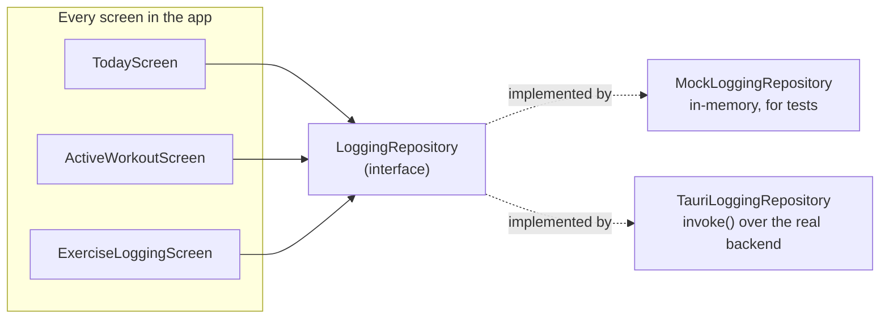
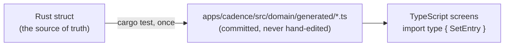
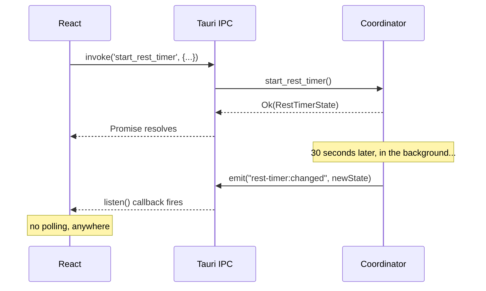

# The Bridge: How Rust Talks to React

_Companion reading for PR [#11](https://github.com/liminal-hq/cadence/pull/11). Want the animated walkthrough instead? → **[Open the interactive version](https://claude.ai/code/artifact/286bb30c-2933-4b63-a73f-5f9f0db74206)**._

---

There's a moment in every desktop-app-with-a-real-backend project where you have to answer an uncomfortable question: the UI is JavaScript, the domain logic is Rust, and a button click needs to get from one to the other without either side having to trust the other's types by hand. Get this wrong and you spend the rest of the project's life with a UI that silently breaks every time someone renames a Rust field.

Cadence's answer has three parts, and the interesting thing about all three is that they were decided _before_ a single real command existed — the entire Logging flow, five screens deep, was built and fully tested against a fake backend that lived in a browser tab. Swapping the fake for the real one was, by design, supposed to be almost boring. This is the story of how it actually was.

## Decision one: build the interface before the implementation

`LoggingRepository` is a TypeScript interface — thirty-some methods like `startRestTimer`, `addWorkoutExercise`, `getHistorySummary`. Every screen in the Logging flow calls these methods and nothing else. Not `fetch`, not `invoke` directly, not a hand-rolled API client. Just this one interface, injected via React context.



For the first several months of Cadence's life, only the mock existed. That's not a shortcut that happened to work out — it's the whole reason it _could_ work out. Because every screen was written against the interface, not the implementation, the day the real Rust backend was ready, swapping which class got constructed in `main.tsx` was a one-line change:

```diff
- <RepositoryProvider repository={mockRepository}>
+ <RepositoryProvider repository={tauriRepository}>
```

No screen changed. No component changed. 152 passing JS tests kept passing, because they still run against the mock — the mock isn't a scaffold that gets torn down, it's a permanent, first-class implementation of the same contract the real one honours.

## Decision two: let the types travel one direction, automatically

The obvious failure mode here is drift: Rust's `SetEntry` struct gains a field, nobody remembers to update the hand-written TypeScript type, and six weeks later a set silently fails to log because the frontend never learned it needs to send a new required field.

Cadence closes this with [`ts-rs`](https://github.com/Aleph-Alpha/ts-rs) — every DTO that crosses the Rust/TypeScript boundary is annotated once, in Rust, and the TypeScript file is _generated_, not written:

```rust
#[derive(Serialize, Deserialize)]
#[cfg_attr(test, derive(ts_rs::TS))]
#[cfg_attr(test, ts(export, export_to = "../../src/domain/generated/"))]
#[serde(rename_all = "camelCase")]
pub struct SetEntry {
    pub id: String,
    #[ts(optional)]
    pub weight_kg: Option<f64>,
    // ...
}
```



`cargo test` runs the generator as a side effect of testing, so the bindings are always as current as the last test run — and CI has a dedicated check that regenerates them fresh and diffs against what's committed, failing the build if anyone forgot to run the generator after changing a struct. The type can only drift for as long as it takes CI to notice, which is to say: it can't really drift at all.

## Decision three: commands for asking, events for being told

Most of the bridge is what you'd expect — the frontend calls `invoke('start_rest_timer', { totalMs, options })`, Rust runs `Coordinator::start_rest_timer`, and a `Promise` resolves with the result. Request, response, done.

The rest timer breaks that pattern on purpose. If the frontend only ever _asked_ "what's the current state?", it would have to poll — call `getRestTimerState` every second, in every component that shows a countdown, forever. Instead, the Coordinator pushes:



On the TypeScript side, this is `tauriRepository.ts`'s one genuinely different method — every other method is a one-line `invoke()` wrapper, but `subscribeRestTimer` calls `listen()` instead and hands back an unsubscribe function:

```typescript
subscribeRestTimer(onChange: (state: RestTimerState) => void): Unsubscribe {
    const unlistenPromise = listen<RestTimerState>('rest-timer:changed', (event) =>
        onChange(event.payload),
    );
    return () => { void unlistenPromise.then((unlisten) => unlisten()); };
}
```

## What happens when Rust says no

The last piece is the least glamorous and probably saves the most debugging time: every Rust error crosses the bridge as a typed, tagged object, not a stringified panic message.

```rust
impl Serialize for Error {
    fn serialize<S: Serializer>(&self, serializer: S) -> Result<S::Ok, S::Error> {
        let kind = match self {
            Error::NotFound { .. } => "notFound",
            Error::Validation(_) => "validation",
            Error::Db(_) => "db",
        };
        // { "kind": "notFound", "message": "workout not found: abc-123" }
    }
}
```

`invoke()` rejects its promise with exactly that `{ kind, message }` shape, and `tauriRepository.ts`'s `call()` helper catches it and re-throws a real `Error` instance — so a call site catching an error sees the same `.message`-bearing object it always would have, whether the underlying failure was a Rust `NotFound` or a JavaScript throw in the mock. The seam is invisible from both directions.

## Where to look

- `apps/cadence/src/domain/repository.ts` — the interface every screen actually depends on
- `apps/cadence/src/domain/tauriRepository.ts` — the real implementation, one `invoke()`/`listen()` call per method
- `apps/cadence/src/domain/mockRepository.ts` — the permanent, first-class fake, still exercised by 150+ tests
- `apps/cadence/src/domain/generated/` — never hand-edit anything in here
- `apps/cadence/src-tauri/src/domain/error.rs` — the tagged error shape
