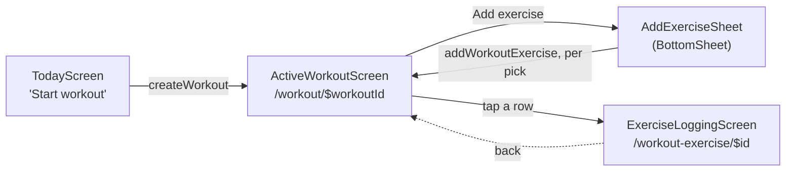
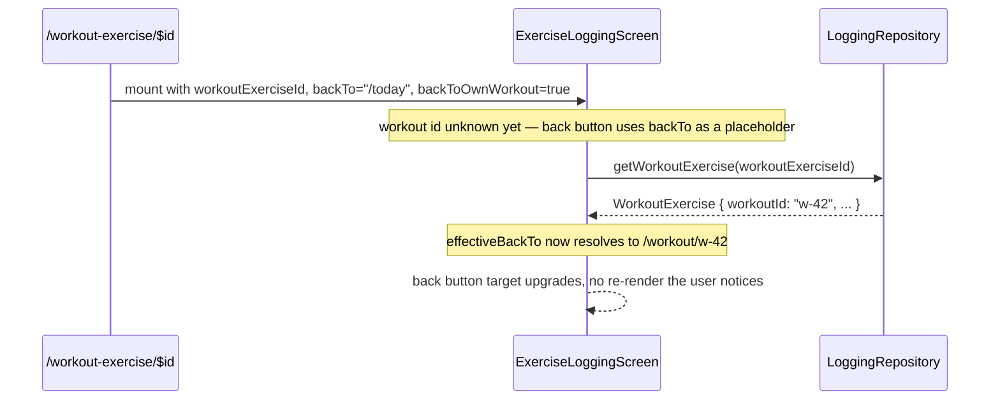
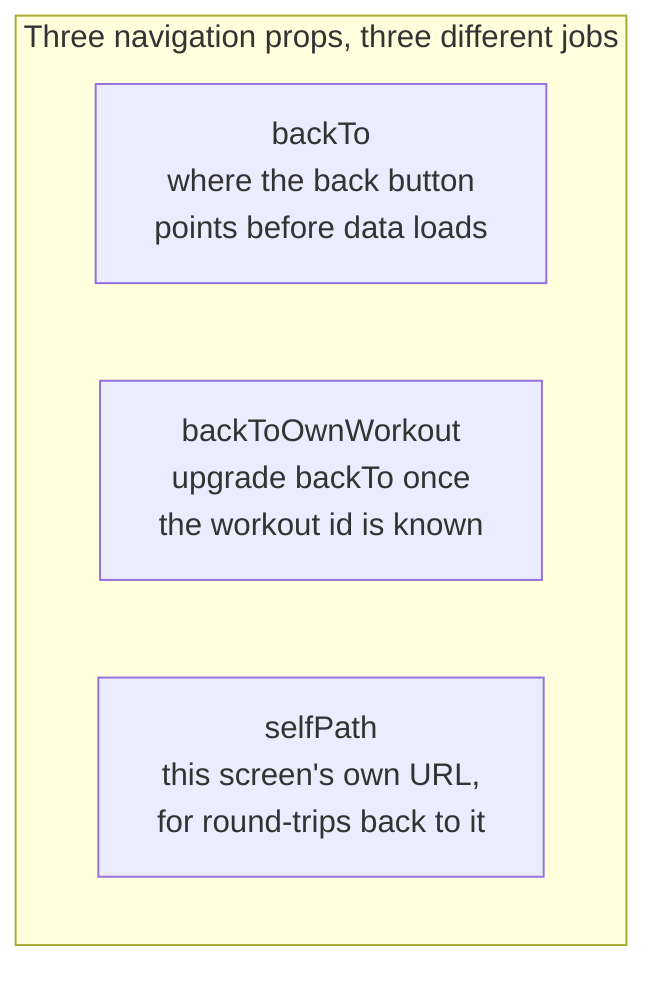

# Building a Real Workout: The Frontend Flow

_Companion reading for PR [#14](https://github.com/liminal-hq/cadence/pull/14). Want the animated walkthrough instead? → **[Open the interactive version](https://claude.ai/code/artifact/e48d3c64-6f22-4ad5-97f8-c31bff8fa2c5)**._

---

For most of Cadence's life, "start a workout" was a lie of convenience. `TodayScreen`'s button didn't start anything — it linked to `/log/sam-default`, one of three fixed demo scenarios baked into the seed migration. Tap it a hundred times and you'd land on the exact same fake bench-press set every time. That was fine while the point was proving out the logging screens themselves. It stopped being fine the moment those screens were real and the workout underneath them wasn't.

This document is about the three screens that closed that gap, and about a small, easy-to-underspecify problem they all had to solve together: when a screen can be reached from more than one place, where does its back button actually go?

## The shape of a workout, on screen

Three screens, one straight line, and it was deliberately kept that line-shaped. `SPEC.md` allows a fuller "quick start" surface — a date picker, a routine choice — but none of that exists yet, and building it speculatively would have meant designing UI for features (routines) that aren't there to select. So `TodayScreen`'s button does the smallest useful thing: it creates an unnamed, in-progress workout dated today and navigates straight in. The richer entry point stays available as later work; the spec explicitly permits this shape as one valid path, not a shortcut around it.

`AddExerciseSheet` is a bottom sheet, not its own route, matching every other "make a choice without losing your place" moment in Cadence — the set editor, the rest timer, the plate calculator. It's also the one place in this flow doing double duty: `SPEC.md` calls for the same picker to support both a single pick (adding one exercise) and a multi-select (adding several at once), so it takes a `multiSelect` prop rather than existing as two components that would drift apart the first time someone fixed a bug in only one of them.

## The problem hiding in a shared screen: where does "back" go?

`ExerciseLoggingScreen` — the actual set-by-set logging surface — didn't start life as part of this flow. It was built and fully tested against demo scenarios first, reachable only from a fixed `/log/$scenario` route that always meant "go back to Today." Wiring it into a real workout meant it now had a second identity: reached from `ActiveWorkoutScreen`, at a URL that carries the workout-exercise's own id, where "back" has to mean "back to _that_ workout," not "back to Today."

The naive fix — pass a `backTo` string as a prop — breaks immediately, because the workout's id isn't known by whoever renders the very first frame. `ExerciseLoggingScreen` loads its own data; for a beat, all it has is a `workoutExerciseId`, not yet the `WorkoutExercise` record that would tell it which workout it belongs to.

The actual fix is a second prop, `backToOwnWorkout`, that says "once you know your own workout, prefer that over whatever `backTo` was passed." `effectiveBackTo` is computed fresh on every render — `backToOwnWorkout ? /workout/${workoutExercise.workoutId} : backTo` — so the button silently upgrades itself the instant the data arrives, with `backTo` staying as the honest fallback for the beat before that and for callers that never set the flag at all.

That "callers that never set the flag" clause matters, because the demo scenarios didn't just disappear — they became the reason this had to be a flag rather than a rewrite. `/log/$scenario` still exists, as a thin adapter that resolves a fixed scenario key to a `workoutExerciseId` and renders the exact same `ExerciseLoggingScreen`, just with `backTo="/today"` and no `backToOwnWorkout`. One component, two honest callers, no forked logic.

## The other half: getting back to where you came from, not just where you started

There's a second, smaller navigation wrinkle worth naming, because it's easy to conflate with the first. `ExerciseLoggingScreen` also has a `selfPath` prop — the screen's own current URL — which exists for exactly one purpose: the History tab action needs to round-trip back to this exact screen, and "this exact screen" is a different question from "where does back go." `backTo` answers "what did the user come from"; `selfPath` answers "how would something else find its way back to me." Keeping them as two props instead of overloading one is what let both demo scenarios and the real route pass different values for each without either one lying about what it meant.

## What this bought: the demo scenarios became optional, not load-bearing

The real payoff of building the flow this way shows up in the PR that comes after this one. Because `ExerciseLoggingScreen` took a `workoutExerciseId` from the start — never a `Scenario` — deleting the three demo scenarios later is a matter of removing an adapter route and some seed rows, not rewriting a screen that 150-odd tests already depend on. The demo data was always a fixture feeding a real interface, the same relationship the mock repository has to the real Tauri one, one layer down. Cadence keeps finding the same shape useful: build the real contract first, let fixtures and fakes be temporary tenants of it, and retiring them later costs almost nothing.

## Where to look

- `apps/cadence/src/screens/TodayScreen.tsx` — the one-line `createWorkout` call that starts it all
- `apps/cadence/src/screens/ActiveWorkoutScreen.tsx` — the ordered exercise list for an in-progress workout
- `apps/cadence/src/components/AddExerciseSheet/AddExerciseSheet.tsx` — the favourites/recent/category/search picker, single- or multi-select
- `apps/cadence/src/screens/ExerciseLoggingScreen.tsx` — see the `backTo`/`backToOwnWorkout`/`selfPath` prop comments directly above the component for the full reasoning
